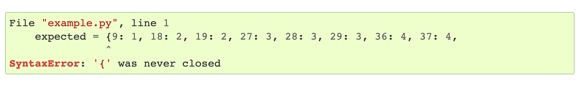
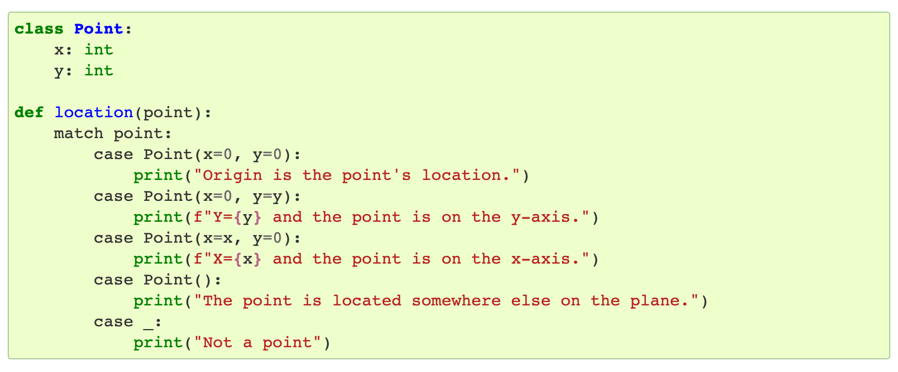
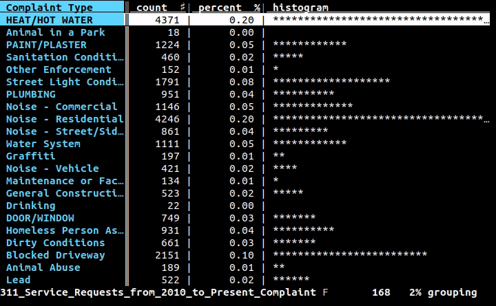
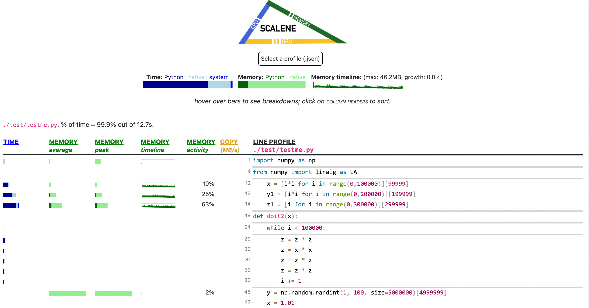
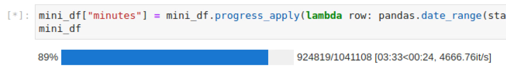

theme: Huerta, 2
footer: https://bit.ly/3vFnQYj - https://github.com/micktwomey/neurosoc-lightning-talk-2022

# What's New in Python

## Michael Twomey
### Senior Cloud Architect at fourTheorem
### @micktwomey
#### Slides: https://github.com/micktwomey/neurosoc-lightning-talk-2022

---

# I :heart: Python

---

# Python 3.10: Better Errors

[https://docs.python.org/3/whatsnew/3.10.html#better-error-messages](https://docs.python.org/3/whatsnew/3.10.html#better-error-messages)



(Thanks Elm!)

---

# Python 3.10: Pattern Matching

[https://docs.python.org/3/whatsnew/3.10.html#pep-634-structural-pattern-matching](https://docs.python.org/3/whatsnew/3.10.html#pep-634-structural-pattern-matching)




(Thanks ML languages!)

---

# Python Future

- Speed improvements
- Multi threading improvements
- Packaging

--- 

# I :heart: tools

---

# VisiData: [https://www.visidata.org](https://www.visidata.org)



---

# Scalene: [https://github.com/plasma-umass/scalene](https://github.com/plasma-umass/scalene)





---

# I :heart: libraries

---

# tqdm: [https://tqdm.github.io](https://tqdm.github.io)

Not new but I just discovered it plugs into Jupyter



(Works in Visual Studio Code notebook editor too!)

---

# FastAPI & pydantic: [https://fastapi.tiangolo.com](https://fastapi.tiangolo.com) & [https://pydantic-docs.helpmanual.io](https://pydantic-docs.helpmanual.io)

```python
from typing import Optional

from fastapi import FastAPI
from pydantic import BaseModel

app = FastAPI()

class Item(BaseModel):
    name: str
    price: float
    is_offer: Optional[bool] = None

@app.get("/")
def read_root():
    return {"Hello": "World"}

@app.get("/items/{item_id}")
def read_item(item_id: int, q: Optional[str] = None):
    return {"item_id": item_id, "q": q}

@app.put("/items/{item_id}")
def update_item(item_id: int, item: Item):
    return {"item_name": item.name, "item_id": item_id}
```


---

# Honourable Mentions

- Jupyter [https://jupyter.org](https://jupyter.org)
- Pandas [https://pandas.pydata.org](https://pandas.pydata.org)
- Dask [https://dask.org](https://dask.org)
- PyArrow [https://arrow.apache.org/docs/python/](https://arrow.apache.org/docs/python/)
- Visual Studio Code [https://code.visualstudio.com](https://code.visualstudio.com)

---

# Sources of Info

How do I keep up?

---

# Email Newsletters


- [https://www.pythonweekly.com](https://www.pythonweekly.com)
- [https://tldr.tech/](https://tldr.tech/)

---

# News Sites

- [https://lobste.rs](https://lobste.rs)
- [https://hckrnews.com](https://hckrnews.com)
    - AKA [https://news.ycombinator.com](https://news.ycombinator.com)

---

# Python Info

- [https://realpython.com](https://realpython.com)
- [https://pythonspeed.com/](https://pythonspeed.com/)
- [https://docs.python.org/3/whatsnew/index.html](https://docs.python.org/3/whatsnew/index.html)

---

# Slides: https://bit.ly/3vFnQYj
[https://github.com/micktwomey/neurosoc-lightning-talk-2022](https://github.com/micktwomey/neurosoc-lightning-talk-2022)


