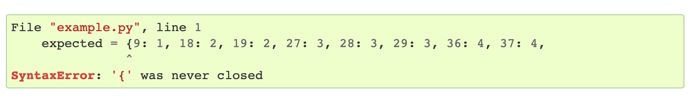
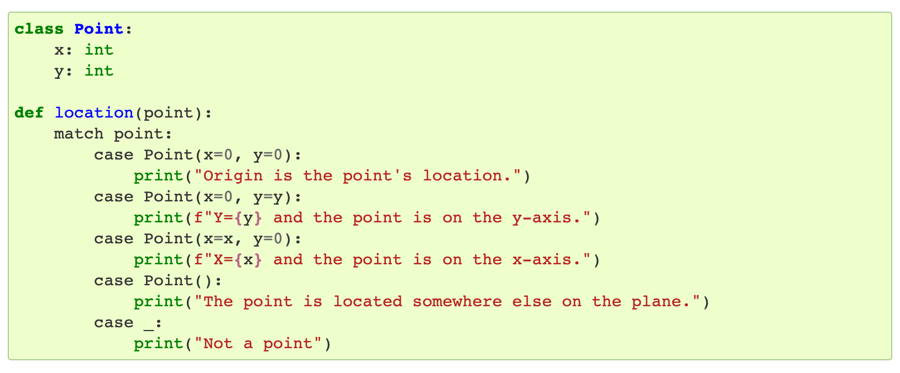
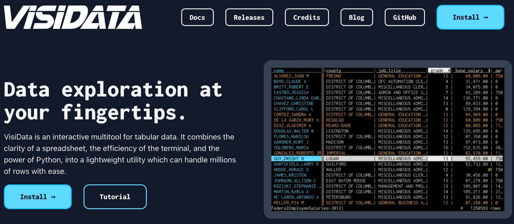
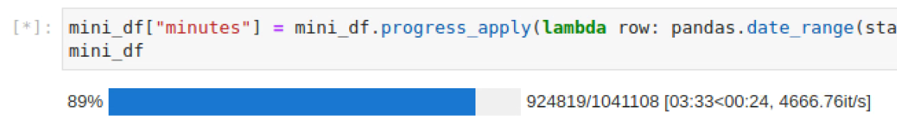

theme: Plex, 1
footer: https://bit.ly/3vFnQYj

# What's New in Python

## Michael Twomey
### Senior Cloud Architect at fourTheorem
#### Slides: https://github.com/micktwomey/neurosoc-lightning-talk-2022

---

# I :heart: Python

---

# Python 3.10: Better Errors

https://docs.python.org/3/whatsnew/3.10.html#better-error-messages



(Thanks Elm!)

---

# Python 3.10: Pattern Matching

https://docs.python.org/3/whatsnew/3.10.html#pep-634-structural-pattern-matching




(Thanks ML languages!)

--- 

# I :heart: tools

---

# VisiData: https://www.visidata.org



---

# Scalene: https://github.com/plasma-umass/scalene


---

# I :heart: libraries

---

# tqdm

Not new but I just discovered it plugs into Jupyter



(Works in Visual Studio Code notebook editor too!)

---

# FastAPI and pydantic

```python
from typing import Optional

from fastapi import FastAPI
from pydantic import BaseModel

app = FastAPI()


class Item(BaseModel):
    name: str
    price: float
    is_offer: Optional[bool] = None


@app.get("/")
def read_root():
    return {"Hello": "World"}


@app.get("/items/{item_id}")
def read_item(item_id: int, q: Optional[str] = None):
    return {"item_id": item_id, "q": q}


@app.put("/items/{item_id}")
def update_item(item_id: int, item: Item):
    return {"item_name": item.name, "item_id": item_id}
```


---

# Sources of Info

How do I keep up?

---

# Email Newsletters


- https://www.pythonweekly.com
- https://tldr.tech/

---

# News Sites

- https://lobste.rs
- https://hckrnews.com AKA https://news.ycombinator.com

---

# Python Info

- https://realpython.com
- https://pythonspeed.com/
- https://docs.python.org/3/whatsnew/index.html

---

# Slides: https://bit.ly/3vFnQYj
https://github.com/micktwomey/neurosoc-lightning-talk-2022


